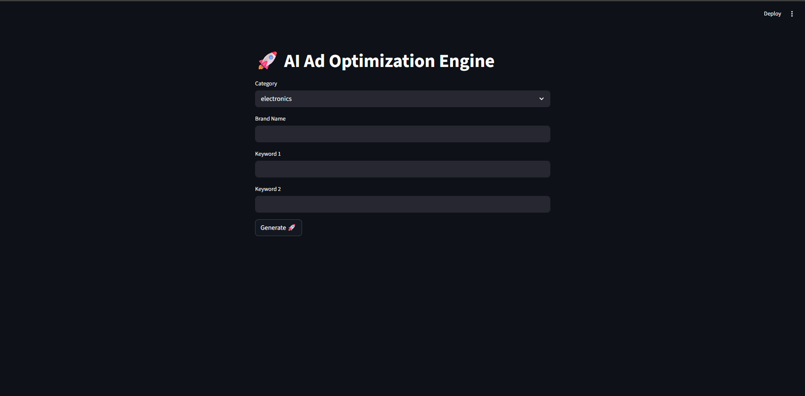
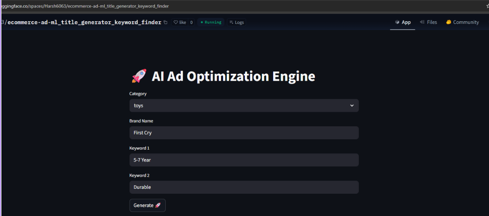
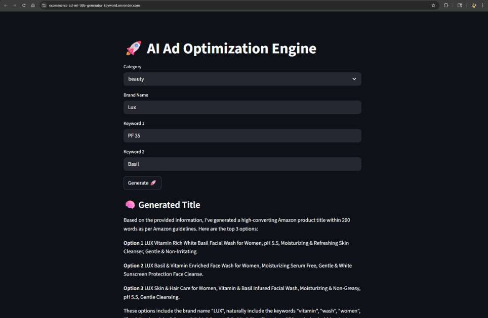
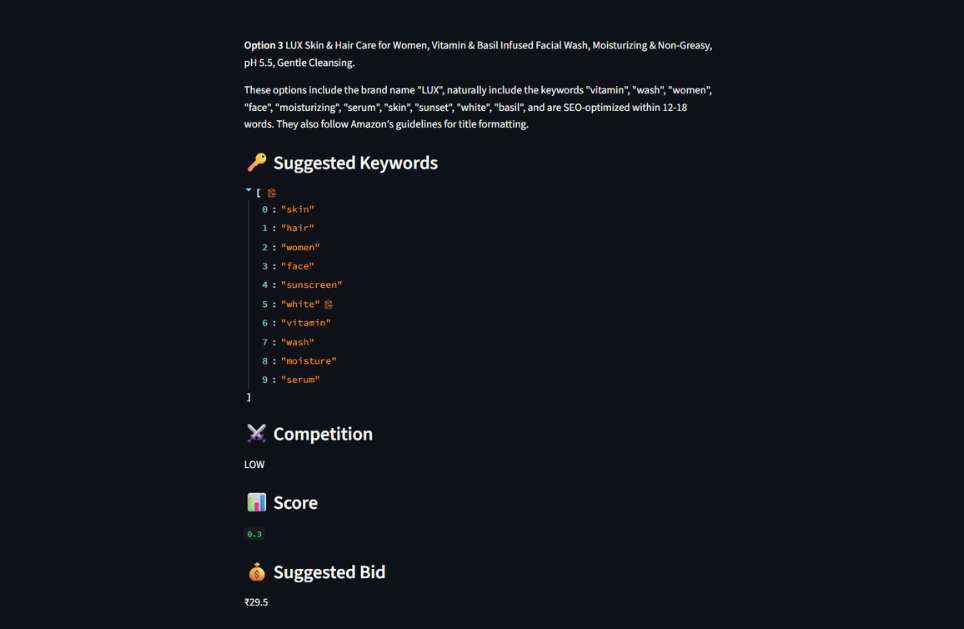

# 🚀 AI-Powered E-Commerce Ads Optimization Engine

An end-to-end **Machine Learning + RAG-based system** that helps optimize e-commerce ads by generating:

* 🧠 AI-powered product titles
* 🔑 High-performing keywords
* ⚔️ Competition analysis
* 💰 Suggested bidding strategy

Built using **ML, NLP, LLMs (Groq), and MLOps (CI/CD + Docker)**.

---

# 🛠️ Technologies Used & Purpose

| Tool / Tech                | Purpose                                  |
| -------------------------- | ---------------------------------------- |
| **Pandas, NumPy**          | Data cleaning & preprocessing            |
| **Scikit-learn**           | ML pipeline & regression models          |
| **XGBoost**                | High-performance bid prediction          |
| **MLflow**                 | Experiment tracking & model selection    |
| **FAISS**                  | Vector search for similar products (RAG) |
| **HuggingFace Embeddings** | Semantic similarity for titles           |
| **Groq (LLaMA3)**          | LLM-based title generation               |
| **Streamlit**              | Interactive UI                           |
| **Docker**                 | Containerized deployment                 |
| **GitHub Actions**         | CI/CD automation                         |

---

# 📌 Problem Statement

In e-commerce advertising (Amazon, Flipkart, Q-commerce), selecting:

* the right **keywords**
* optimal **bids**
* high-converting **titles**

is critical but complex and data-driven.

👉 Manual optimization leads to:

* poor ad performance
* wasted budget
* low conversion rates

---

# 🧠 System Architecture

```
User Input (Category + Brand + Keywords)
        ↓
Keyword Engine (Title + Data Driven)
        ↓
Competition Analysis + Bid Prediction (ML)
        ↓
RAG Retrieval (FAISS - similar products)
        ↓
LLM (Groq - LLaMA3)
        ↓
Generated Title + Keywords + Bid
```

---

# ⚙️ Features

## 🔑 Keyword Suggestion

* Extracts keywords directly from product titles
* Category-aware filtering
* Frequency-based ranking

---

## 🧠 AI Title Generation (RAG + LLM)

* Retrieves similar product titles using FAISS
* Uses **Groq LLaMA3**
* Generates SEO-optimized product titles

---

## 📊 Competition Analysis

* Score between **0 → 1**
* Classification:

  * LOW
  * MEDIUM
  * HIGH
* Based on reviews + ranking + category trends

---

## 💰 Bid Prediction (ML)

* Models used:

  * Random Forest
  * XGBoost
  * Linear Regression
* Uses aggregated features for stability
* Best model selected via MLflow

---

# 🚀 Setup Instructions

## 1️⃣ Clone Repo

```bash
git clone https://github.com/Harsh6063/ecommerce-ad-ml_title_generator_keyword_finder.git
cd ecommerce-ad-ml_title_generator_keyword_finder
```

---

## 2️⃣ Install Dependencies

```bash
pip install -r requirements.txt
```

---

## 3️⃣ Add Environment Variables

Create `.env`:

```env
GROQ_API_KEY=your_api_key_here
```

---

## 4️⃣ Run Pipeline

```bash
python amazon_scraper.py
python preprocess.py
python train_model.py
```

---

## 5️⃣ Run App

```bash
streamlit run app.py
```

---

# 🧪 CI/CD Pipeline

Automated using GitHub Actions:

* Install dependencies
* Run preprocessing
* Train model
* Validate app

---

# 🐳 Docker Support

```bash
docker build -t ad-ml-app .
docker run -p 8501:8501 ad-ml-app
```

---

# 🌐 Deployment

## 🚀 Render (Backend Deployment)

👉 https://ecommerce-ad-ml-title-generator-keyword.onrender.com/
### ⚠️ Drawback

* Free tier has **512MB memory limit**
* App may crash due to:

  * FAISS
  * Embeddings
  * Large dataset
* Cold start delay (~30–50 sec)

---

## 🤗 Hugging Face Spaces (Recommended)

👉 https://huggingface.co/spaces/Harsh6063/ecommerce-ad-ml_title_generator_keyword_finder

### ✔ Advantages

* Better suited for ML apps
* Handles embeddings + models efficiently
* Faster startup compared to Render

---

# 📊 Example Output

### Input:

```
Category: Beauty
Brand: Lakme
Keyword1: skin
Keyword2: glow
```

---

### Output:

```
Title: Lakme Skin Glow Face Cream with Vitamin C Brightening Formula
Keywords: skin, glow, cream, face, serum
Competition: HIGH
Score: 0.82
Bid: ₹18.5
```

---

## 📸 Screenshots

### 🖥️ Homepage


### 📊 Input


### 🧠 AI Generated Title


### 🔑 Keywords Suggested



# ⚠️ Notes

* Models and processed data are **not stored in repo**
* Generated dynamically during runtime / CI
* MLflow tracking is enabled locally

---


# ⭐ If you like this project

Give it a ⭐ on GitHub and connect!
